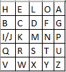
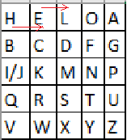
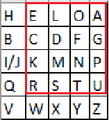
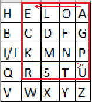

    Шифр Плейфера

Классический шифр Плейфера предполагает в основе матрицу 5х5, заполненную символами латинского алфавита (i и j пишутся в одну клетку), кодовое слово и дальнейшую манипуляцию над ними.

Пусть кодовое слово у нас будет «HELLO».

Сначала поступаем как с предыдущим шифром, т.е. уберем повторы и запишем слово в начале алфавита.

Теперь возьмем любое сообщение. Например, «I LOVE HABR AND GITHUB».

Разобьем его на биграммы, т.е. на пары символов, не учитывая пробелы.

IL OV EH AB RA ND GI TH UB.

Если бы сообщение было из нечетного количества символов, или в биграмме были бы два одинаковых символа (LL, например), то на место недостающего или повторившегося символа ставится символ X.

Шифрование выполняется по нескольким несложным правилам:

1) Если символы биграммы находятся в матрице на одной строке — смещаем их вправо на одну позицию. Если символ был крайним в ряду — он становится первым.

Например, EH становится LE.

2) Если символы биграммы находятся в одном столбце, то они смещаются на одну позицию вниз. Если символ находился в самом низу столбца, то он принимает значение самого верхнего.

Например, если бы у нас была биграмма LX, то она стала бы DL.

3) Если символы не находятся ни на одной строке, ни на одном столбце, то строим прямоугольник, где наши символы — края диагонали. И меняем углы местами.

Например, биграмма RA.

По этим правилам, шифруем все сообщение.

IL OV EH AB RA ND GI TH UB.
KO HY LE HG EU MF BP QO QG

Если убрать пробелы, то получим следующее зашифрованное сообщение:

KOHYLEHGEUMFBPQOQG